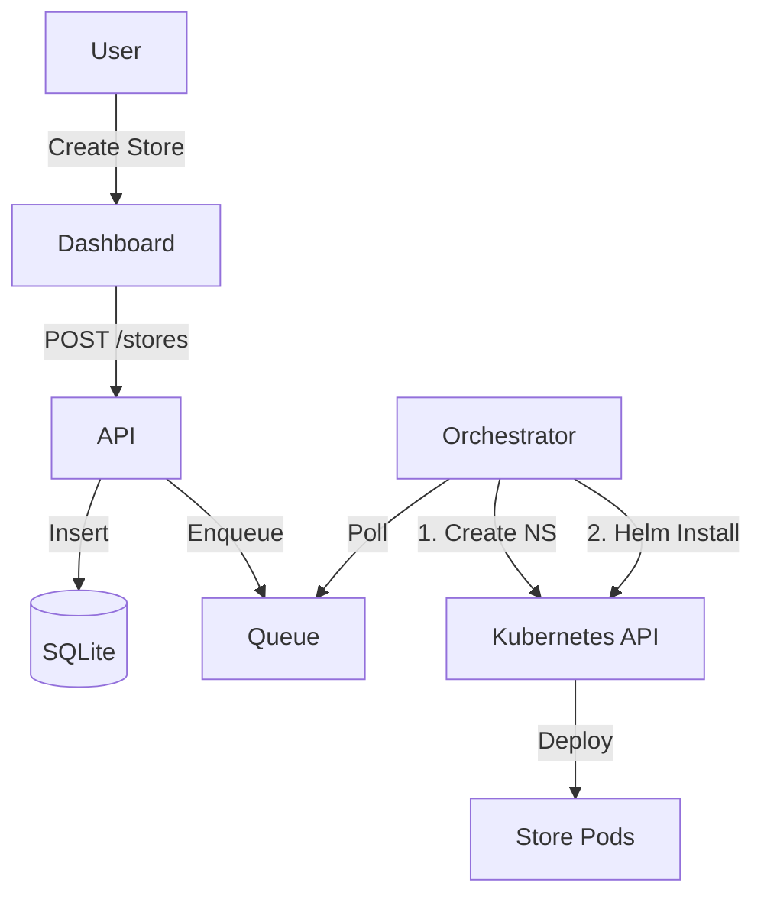

# System Design: Store Provisioning Platform

## 1. Architecture Overview

The platform enables self-service provisioning of WooCommerce stores on Kubernetes. It follows a declarative, GitOps-friendly approach where the desired state is defined by Helm charts and managed by an in-cluster orchestrator.

### Components

1.  **Dashboard (Frontend)**
    *   **Tech**: React (Vite), Tailwind CSS.
    *   **Role**: User interface for store management.
    *   **Flow**: Polls the Backend API for store status.

2.  **Backend API**
    *   **Tech**: Node.js (Express), SQLite (persisted via PVC).
    *   **Role**:
        *   Manages `Store` entity lifecycle (PROVISIONING, READY, FAILED, DELETING).
        *   Exposes REST endpoints.
        *   Enqueues provisioning tasks.

3.  **Provisioning Orchestrator**
    *   **Tech**: Node.js (integrated with Backend for simplicity, or separate worker).
    *   **Role**:
        *   Watches task queue.
        *   interacts with Kubernetes API to create Namespaces, Quotas, Secrets.
        *   Executes `helm upgrade --install` to deploy the `store-woocommerce` chart.
        *   Updates store status based on rollout success/failure.

4.  **Store Runtime**
    *   **Tech**: WordPress + WooCommerce, MySQL.
    *   **Isolation**: One Namespace per store.

### Data Flow

## 2. Design Decisions & Tradeoffs

| Decision | Alternative | Reason |
| :--- | :--- | :--- |
| **Helm for Provisioning** | Kustomize / Plain Manifests | Helm manages the release lifecycle (install, upgrade, uninstall, rollback) logically, encapsulating complexity. |
| **Node.js Orchestrator** | ArgoCD / Flux | Direct control over the "business logic" of provisioning (e.g., creating DB records, custom logic before/after) without complex CRDs for a MVP. Easier to explain. |
| **Namespace per Store** | Shared Namespace | Strong isolation for security and resource management (Quotas, NetworkPolicies). Easy to delete everything by deleting the NS. |
| **SQLite (PVC)** | Postgres (External) | Simpler for local demo and "platform" metadata is minimal. Production would use Cloud SQL/RDS. |
| **In-Process Queue** | Redis / RabbitMQ | Keeps the architecture simple and deployment single-container for the platform logic. Sufficient for low volume demo. |

## 3. Scalability

*   **Platform**: The API/Orchestrator is stateless (except for the SQLite file). To scale, we would migrate SQLite to Postgres and run multiple replicas of the API.
*   **Stores**: Each store is isolated. Scaling stores means adding more Worker Nodes to the Kubernetes cluster.
*   **Ingress**: Using a single Ingress Controller. Scaling ingress involves tuning the Nginx Controller or using a Cloud Load Balancer.

## 4. Security

*   **Isolation**: NetworkPolicies deny cross-namespace traffic by default.
*   **Secrets**: Database passwords generated randomly and stored in K8s Secrets, mounted as env vars.
*   **RBAC**: The Orchestrator ServiceAccount has minimal required permissions (ClusterRole for creating specific resources).
*   **Ingress**: TLS termination at the Ingress level (cert-manager in prod).

## 5. Upgrade & Rollback Strategy

*   **Platform Upgrade**: `helm upgrade platform ./helm/platform`.
*   **Store Upgrade**:
    *   The backend can expose an "Upgrade" button.
    *   Orchestrator runs `helm upgrade store-<id> ...` with new chart version.
    *   **Rollback**: If `helm upgrade` fails, Helm automatically keeps the previous release history. We can implement `helm rollback` logic in the orchestrator.

## 6. Local vs Production (Detailed Comparison)

| Feature | Local (Kind/Minikube) | Production (VPS/k3s) |
| :--- | :--- | :--- |
| **Domain** | `*.localtest.me` (loops to 127.0.0.1) | Real Wildcard DNS (e.g., `*.stores.example.com` -> VPS IP) |
| **Ingress** | Nginx Ingress (Kind-specific or standard) | Nginx Ingress (Standard/Helm). TLS via Cert-Manager (LetsEncrypt). |
| **Storage** | `standard` (hostPath/rancher.io) | `local-path` (k3s default) or Cloud CSI (Longhorn/EBS) |
| **Secrets** | Native K8s Secrets (Opaque) | Native K8s Secrets (Encrypted at rest) or External Secrets Operator (AWS SSM/Vault) |
| **Database** | Platform: SQLite (PVC). Store: MySQL (PVC) | Platform: Managed Postgres (RDS). Store: Managed SQL or HA MySQL Operator. |
| **Images** | `imagePullPolicy: IfNotPresent` (Pre-loaded) | `imagePullPolicy: Always` (Private Registry with ImagePullSecrets) |

## 7. Guardrails & Security

*   **Namespace Isolation**: Each store gets a unique namespace (`store-<id>`).
*   **Network Policies**: Default Deny-All inbound traffic for stores. Whitelisted Ingress traffic to Port 80. DB traffic restricted to intra-namespace.
*   **Resource Limits**: `LimitRange` sets default request/limits. `ResourceQuota` caps total pod count (10) and memory (2Gi per store).
*   **API Limits**: Rate limiting (100 req/15min) and Creation limits (5/hour) to prevent abuse.
*   **Max Stores**: Global cap on active stores per platform instance.

## 8. Observability

*   **Platform**:
    *   Logs: JSON structured logs from Backend/Orchestrator.
    *   Metrics: API latency, Store creation time.
*   **Stores**:
    *   Liveness/Readiness Probes ensure failed pods are recycled.
    *   Dashboard polls backend to reflect "Real-time" status (PROVISIONING -> READY/FAILED).
